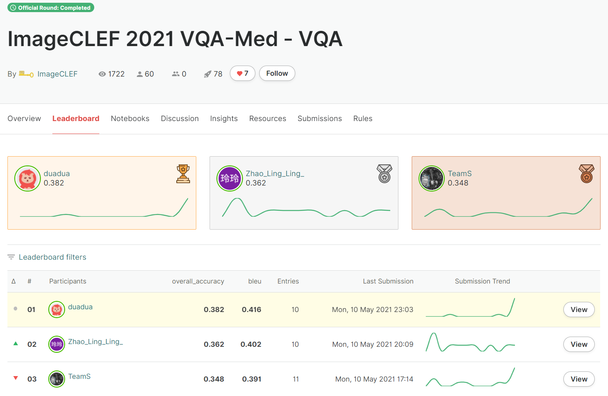

# SYSU-HCP-at-ImageCLEF-VQA-Med-2021
This repository is the official implementation of paper [SYSU-HCP at VQA-Med 2021: A Data-centric Model with Efficient Training Methodology for Medical Visual Question Answering](https://www.researchgate.net/profile/Haifan-Gong-2/publication/357575887_SYSU-HCP_at_VQA-Med_2021_A_Data-centric_Model_with_Efficient_Training_Methodology_for_Medical_Visual_Question_Answering/links/61d51c98da5d105e551cf011/SYSU-HCP-at-VQA-Med-2021-A-Data-centric-Model-with-Efficient-Training-Methodology-for-Medical-Visual-Question-Answering.pdf).

We won first prize in [ImageCLEF 2021 VQA-Med - VQA](https://www.aicrowd.com/challenges/imageclef-2021-vqa-med-vqa/leaderboards).


## Main requirements

  * **torch == 1.4.0**
  * **torchvision == 0.5.0**
  * **tensorboardX == 2.1**
  * **Python 3**

The environment can be created following this:
```bash
# First, create a virtual environment
conda create -n your_env_name python=3.6
conda activate your_env_name

# Second, install the required packages from requirements.txt
conda install pip
pip install -r requirements.txt
```

## Models

The [ResNeSt](https://github.com/zhanghang1989/ResNeSt) needs to be installed before using.

## Datasets

The training set, validation set and test set can be downloaded from the [Google Drive](https://drive.google.com/file/d/1ovF5HF4t49ZJ8YMmaydfvcfeOf08h3yR/view?usp=sharing) directly and should be put in the `data` folder. 

## Training

You can train the model from scratch. The command and corresponding parameters are as follows:
```bash
python train.py [-input_size <int>] [-batch_size <int>] [-backbone <model_name>] [-train_set <Med_LT_train or train>] [-gpu <int>] [-world_size <int>] [-port <int>] [--mixup] [--label_smooth] [--superloss] [-dryrun] [-resume_path <checkpoint.pth>] [-pretrain <checkpoint.pth>]
```

## Evaluation

You can evaluate the trained model and save the results in a csv file.
```bash
python validation.py -model_path <checkpoint.pth> -csv_path <path_to_save_evaluation_results> [-input_size <int>] [-backbone <model>] [-gpu <int>]
```

## Pretrained models for VQA-Med 2021

We provide the pretrained models for VQA-Med 2021 in [Google Drive](https://drive.google.com/file/d/1tsTlAD6VDVhTd-9ocLEmgcoXZKBJqdnS/view?usp=sharing) and [Baidu Cloud](https://pan.baidu.com/s/1Q-P4mqmq2jFDQ2DyYenbqw) (code:i1nn). 

After downloading the models, you can get the result by the following command:
```bash
python inference_ensemble_once.py
```

<!-- The BBN is mainly modified from [BBN](https://github.com/Megvii-Nanjing/BBN), Bio-Bert pretrain is obtained from [Biobert](https://github.com/dmis-lab/biobert), the pickle data should be under the ```BBN-BioBert-Inference/data/``` folder.  -->

<!-- ## Contacts
If you have any questions about our work, please do not hesitate to contact us by emails.

Haifan Gong: haifangong@outlook.com -->

## Citing this repository
If you find this code useful in your work, please consider citing us:

```
@inproceedings{gong2021sysu-hcp,
  author    = {Haifan Gong and
               Ricong Huang and
               Guanqi Chen and
               Guanbin Li},
  title     = {SYSU-HCP at VQA-Med 2021: A Data-centric Model with Efficient Training Methodology for Medical Visual Question Answering},
  booktitle = {CLEF 2021 -- Conference and Labs of the Evaluation Forum, September 21--24, 2021, Bucharest, Romania},
  series    = {CEUR Workshop Proceedings},
  year      = {2021},
}
```